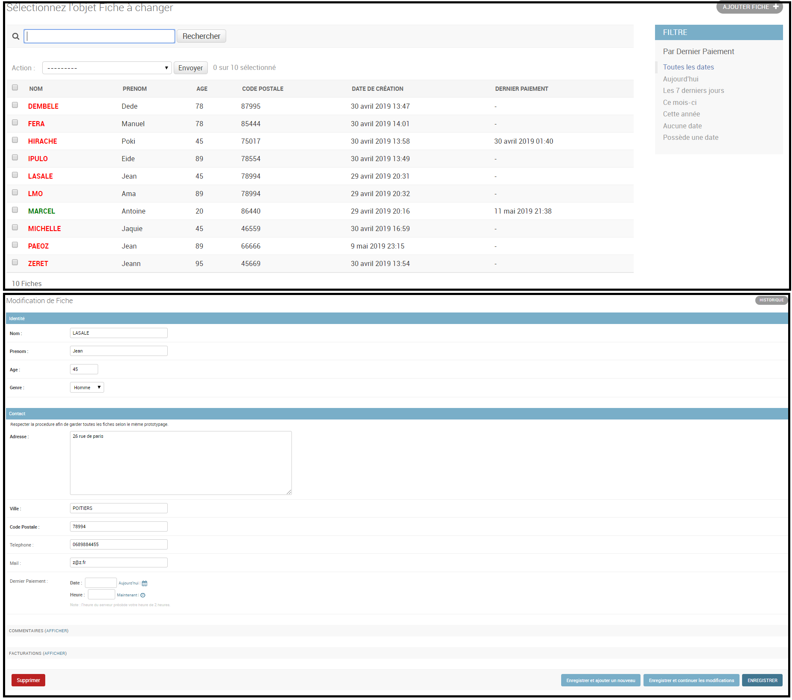
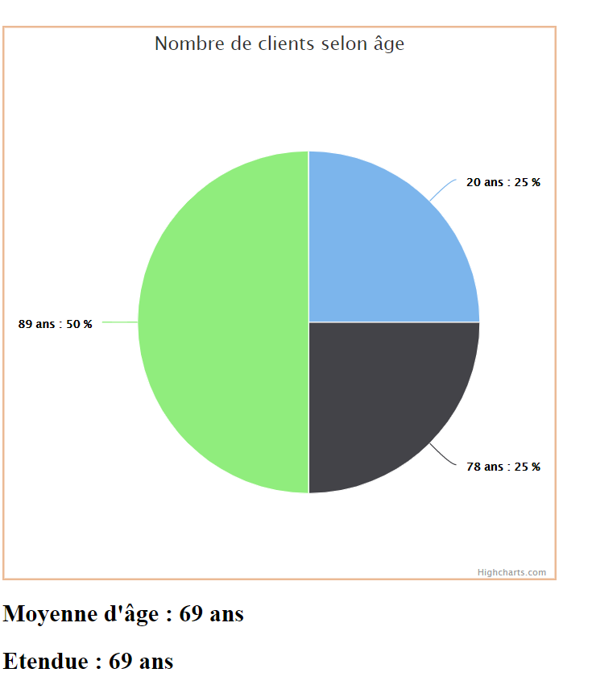
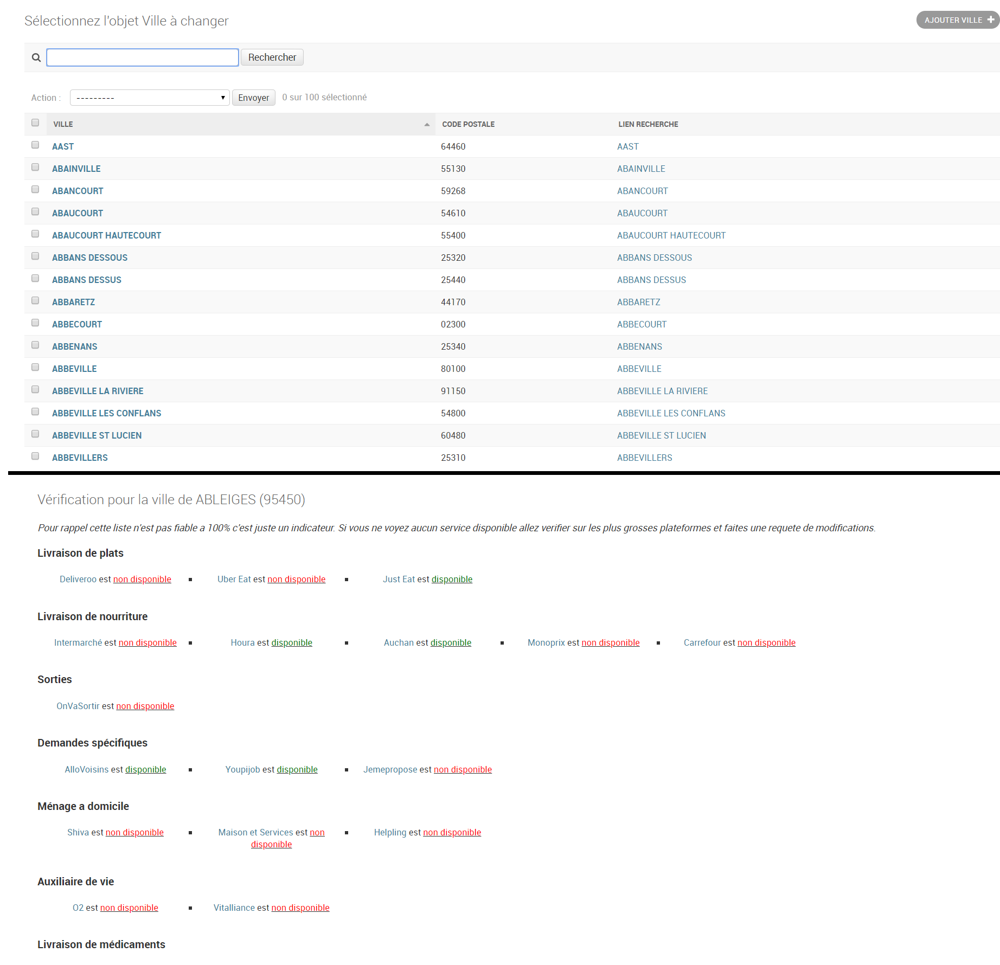

# hestios

*Side project de services à personnes âgés.*

*Site en Django Python de gestion d'utilisateurs et statistiques.*

*Non finalisé.*

___

La plateforme développé et abandonné servait d'outil d'administration. On pouvais y gerer nos utilisateurs, nos relations avec eux ainsi que leurs facturation et des statistiques.

On avait aussi scraper 17 outils pouvant servir aux personnes agées afin d'avoir la liste des villes qu'ils deservent.

Les outils scraper sont : 
- Deliveroo, Uber Eat, Just Eat pour la livraison de plats
- Intermarché, Houra, Auchan, Monoprix, Carrefour pour la livraison de nourriture
- OnVaSortir pour les sorties
- AlloVoisins, Youpijob, Jemepropose pour les demandes spécifiques
- Shiva, Maison et Services, Helpling pour le ménage à domicile
- O2, Vitalliance pour les auxiliaires de vie
- MesMedicamentsChezMoi pour la livraison de médicaments

### Gestion des utilisateurs

### Statistiques des utilisateurs

### Scraping des villes et des outils

